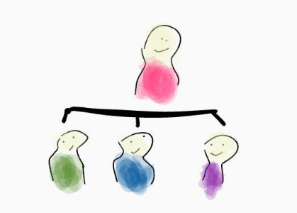
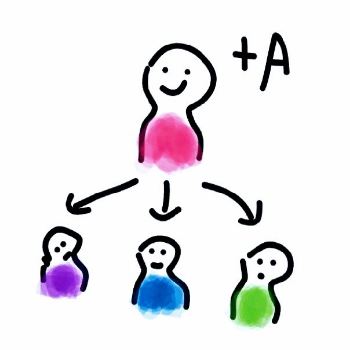
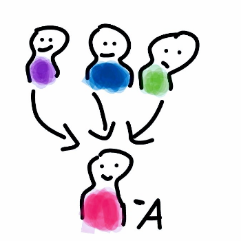
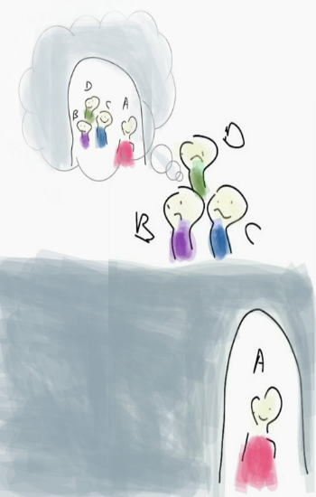

Variances in Scala
====================

Types
----------------------------

A value is the result of an expression, a type is a set of values.
Each value in our program has a type, and every type has a finite/infinite possible values. For instance:

- Boolean is a type that has two possible values: `true` or `false`
- String has infinite possible values.
- This sum type is a set of 3 values, `[Circle, Triangle, Rectangle]`

.. code-block:: scala

    sealed trait Shape
    case object Circle    extends Shape
    case object Triangle  extends Shape
    case object Rectangle extends Shape

* Product type: `Container` has a combination of n values of tyep `Shape` with m values of type `Boolean` -> 3*2 = 6 possible values.

.. code-block:: scala

    case class Container(form: Shape, hasBg: Boolean)

Subtypes
---------------

In our programming daily life, we encounter subtypes like:

* `Some` and `None` are subtypes of `Option`
* In the previous example, `Circle, Triangle` and `Rectangle` are subtypes of `Shape`
* `Nothing` is the subtype of every type and there is no instances of this type.
* `Any` is the supertype of every type in Scala. It's the root of the Scala class hierarchy. So every type is subtype of `Any`.

   Scala subtypes

More complex types
--------------------

A simple type:

.. code-block:: scala

   case class Person(id: Int, name: String) 

`Person` is called a type constructor with 0 arity.

Higher kinded type (HKT)
--------------------------

It's about how to classify the type constructors:

* `Person` is kind (star) `*` the type constructor has no type parameters
* `Option[A]` is kind (start to star): `* => *` because `Option` has one parameter, like the function `f(a: A): B` is `f: A=> B`
* `Map[K, V]` is kind (star star to star) `[*, *] => *`, like the function `f(k: K, v: V): R` is `f: (K, V) => R`

Variance annotation
----------------------

    Depending to the variance of the type constructor, the subtyping relation can be either preserved (covariance), reserved (contravariance), or ignored (invariance).

Covariance
~~~~~~~~~~~~~~

Contravariance
~~~~~~~~~~~~~~~~

Invariance
~~~~~~~~~~~

Function type
-----------------

Let's define a simple function:

.. code-block:: scala

    scala> val addOne = (i: Int) => i + 1
    addOne: Int => Int = <function1>

First class functions is Scala are implemented as `FucntionX` classes. (`X` equals to the number of its argument)

In this example, we have a funciton with on eparameter, the compiler picks `Funciton[Int, Int]` as the underlying typer.

`Function` has this type signature: `Funciton[-A, +B]`

`-` and `+` are variance annotations

`Funciton[-A, +B]` is:

* *Contravariant* in the **input** type `A` (marked with `-`) where `A` can be replaced with the derived type. (more general input argument)

  * *Covariant* in the **output** type `B` (marked with `+`) where `B` can be replaced with the base type. (more specific return type)

  Following this rule:

    "Be conservative in what you do, be liberal in what you accept from others" -- robustness principle

Upper and Lower type bounds
------------------------------

Upper/Lower type bounds of a parameter type reveal more information about that type.

*Upper type bounds:* `A <: T` means that `A` refers to a subtype of `T`

**Example:**

.. code-block:: scala

    abstract class Pet extends Animal {}
    case class Cat(???) extends Pet
    case class Dog(???) extends Pet
    trait Zoo[T <: Pet]{
      ...
    }

**Lower type bounds:** `A >: T` means that `A` referes to a supertype of `T`.

We will see an exmaple soon.

In order to understand the previous sections, we need to see a simple example.

Let's re-implement tye type `List`.

.. code-block:: scala

    abstract class List[T] { ... }
    case class Nil[T]() extends List[T]
    case class Cons[T](head: T, tail: List[T]) extends List[T]

The type parameter at `list` is not marked covariant or contravariant. So `List` is *invariant* in `T` which means List can only have elements of that type = `T` cannot be changed.

.. code-block:: scala

    sealed trait A
    case object B extends A
    case object C extends A
    case object D extends A

If we want to define a list of type A that has elements of its subtypes we'll get a compile error.

::

    val list: List[A] = Cons(B, Cons(C, Cons(D, Nil()))) 
    //compile error: class List is *invariant* in type A.

To make their dream come true, `List` of the **subtypes** of `A` should be represented as `List[A]`

In simple types, we're able to define `val a: A = B`

but in HKT we have to add the **variance annotation `+`** to the type parameter of our generic class `List` to make it **covariant** in its type `T` : `List[+T]`

.. code-block:: scala

    abstract class List[+T] { ... }
    case class Nil[T]() extends List[T] 
    case class Cons[+T](head: T, tail: List[T]) extends List[T]

Before checking if it works, let's improve the `case class Nil()`

Every type `T` is a supertype of `Nothing`. `List` is **covariant** in `T`, so we can say that a `List[Nothing` is a subtype of `List[T]`.

`Nil` doesn't use the type paremeter, it could `extends List[Nothing]`

.. code-block:: scala

    case object Nil extend List[Nothing]

Looks nicer!

.. code-block:: scala

    val list: List[A] = Cons(B, Cons(C, Cons(D, Nil)))) //it works :)

Now let's implement a function `contains` in `List` that checks if a given element exists.

.. code-block:: scala

    abstract class List[+T] { self =>
    def contains(elem: T): Boolean = self match {
        case Cons(x, xs) if x == elem => true
        case Cons(x, xs) => xs.contains(elem)
        case Nil         => false
        }
    }

Oups there is a compile error:

::

    error: covariant type T occurs in contravariant position in type T of value elem
        def contains(elem: T): Boolean = self match {

I talked previously about `Function[-A, +B]` and mentioned that the inputs of functions are **contravariant** and their output are covariant. In our case, `List` is covariant in `T`,

The problem is in the input argument of `contains` the element is a value of type `T` which is covariant, we need to make it contravariant to be able to pass it into `Funciton1`.

We can do that using **lower type bounds** `>:` !

.. code-block:: scala

    abstract class List[+T] { self =>
        def contains[T1 >: T](elem: T1): Boolean = self match {
            case Cons(x, xs) if x == elem => true
            case Cons(x, xs) => xs.contains(elem)
            case Nil         => false
            }
    }

*NOTE.* If you have a *contravariant* type parameter and you need to define a function that returns a value of that type, you’ll need to use the term <: to make the output covariant.

   Scala subtypes

